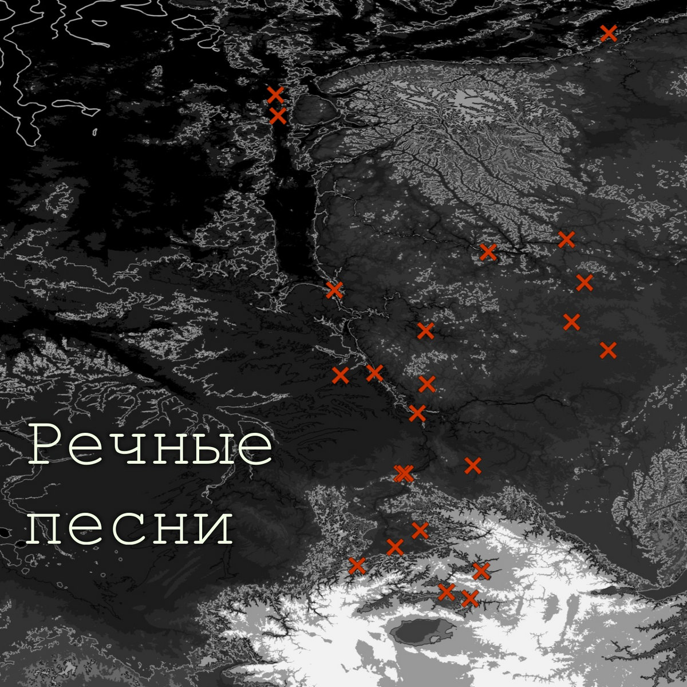

# Речные песни // Rivers' songs
Проект на основе данных научных наблюдений, в котором звучат сибирские реки. 
  

>мы обогащаемся, уча иностранный язык - но это удивительная случайность, ведь учим мы его не потому, что не можем выразиться, а потому, что наш собеседник говорит только на нём. 
>находя новый канал коммуникации, мы преодолеваем лимитность другого; и так природа преодолевает ограниченность человека в её понимании, когда обретает голос, различимый, воспринимаемый человеческим существом.

из вкладыша в кассету к альбому "Речные песни"
  

Я предлагаю интерактивную карту, где можно послушать, что случалось с реками Енисейского бассейна за четверть века. Звук сгенерирован по архиву данных уровня рек Енисбаса в 2002-2026. Годовой ход уровня складывается из сезонных колебаний (весенние паводки, зимние и летние межени) и синоптических - быстрой реакции рек на внешние события. Вместе они рассказывают о многолетних тенденциях в жизни реки вместе с минутной суетой.

  
Все природные черты и динамика в звуке нетронуты, потому что природный феномен не нуждается в очеловечивании или трактовке, нет необходимости вмешиваться в него композиторством: и процесс, и звук самоценны вне выстраивания отношений человека с ним.

Технически это вычисленный звук, который производил бы осциллятор, если бы колебался по закону хода уровня рек Енисейского бассейна на выбранных гидрологических постах.

  
В рамках этой работы выпущен альбом, где используется больше техник алгоритмического синтеза звука из данных гидропостов. \
Альбом можно послушать на: \
Бэндкэмп: [https://shlms.bandcamp.com/album/-](https://shlms.bandcamp.com/album/rivers-songs) \
Ютуб: https://youtu.be/ilWTYEJtL2U

Меня зовут Саша Сойфер, я океанолог, музыкант, science art художница.
Следить за другими моими проектами можно в [инстаграме](https://www.instagram.com/shulamis_) и [телеграме](https://t.me/shulamis) shulamis.

-----------------------------------------
A project based on scientific observation data, revealing the voice of Siberian rivers.

>we enrich ourselves by learning foreign languages, but that is only an unexpected side effect. we do not learn them because we lack the ability to express ourselves, but because the person >we are speaking to understands only that language. by finding a new channel of communication, we overcome the limits of the other; in the same way, nature overcomes our limitations in understanding it when it acquires a voice perceptible to us.

from description of 'Rivers' songs' cassette 
  

I’m presenting an interactive map where you can hear what has been happening to the rivers of the Yenisei Basin over the past quarter-century. The sound was generated using archived data on river levels in the Yenisei Basin from 2002 to 2026. The year river cycle consists of seasonal fluctuations (spring floods, winter and summer low water periods) and synoptic fluctuations—the rivers’ rapid response to external events. Together, they reveal both long-term trends in the river’s life and its moment-to-moment fluctuations.

  
All the natural characteristics and dynamics of the sound remain intact, because a natural phenomenon does not need to be anthropomorphized or interpreted; there is no need to intervene in it through composition: both the process and the sound have intrinsic value independent of any human relationship to them.

Technically, this is a computed sound that an oscillator would produce if it oscillated according to the pattern of river levels in the Yenisei Basin at selected hydrological stations.
  

As part of this project, an album with greater use of algorithmic sound synthesis from hydrological data was released. \
You can listen to the album at: \
Bandcamp: [https://shlms.bandcamp.com/album/-](https://shlms.bandcamp.com/album/rivers-songs) \
YouTube: https://youtu.be/ilWTYEJtL2U

My name is Sasha Soyfer; I’m an oceanographer, musician, and science artist.
You can follow my other projects on [Instagram](https://www.instagram.com/shulamis_) and [Telegram](https://t.me/shulamis) under the username shulamis.
